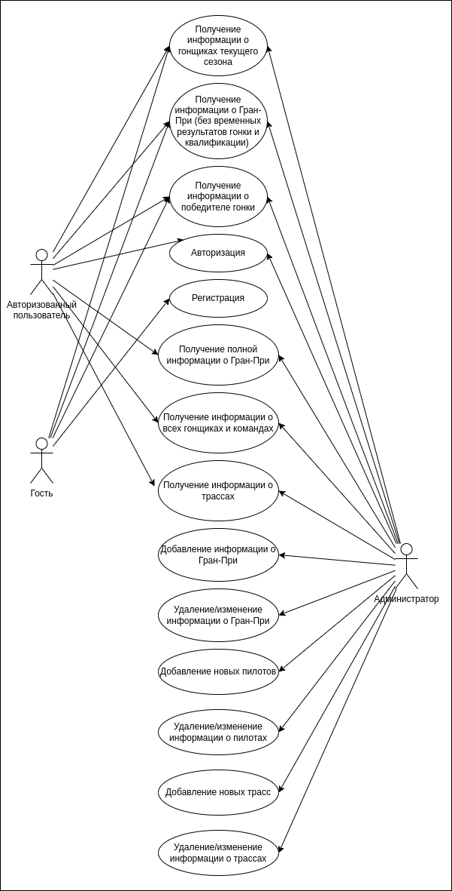
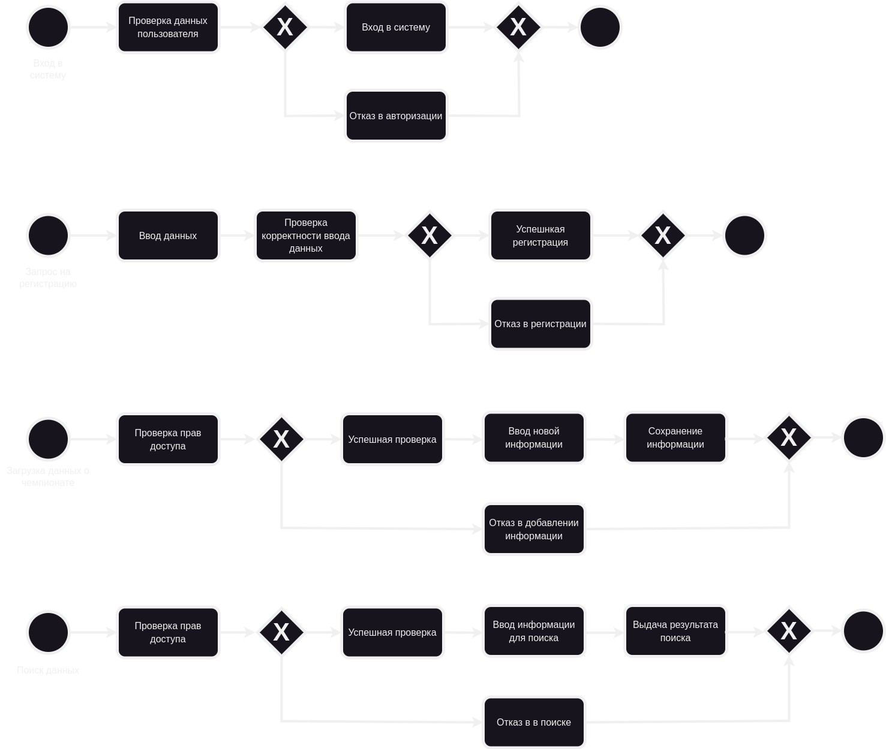
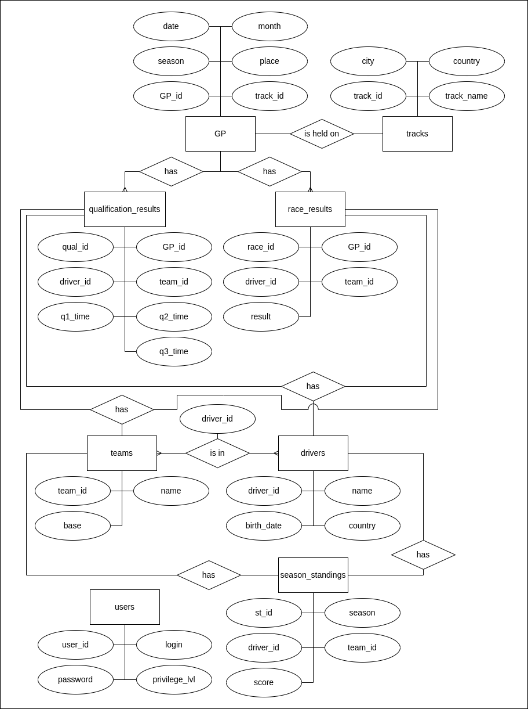
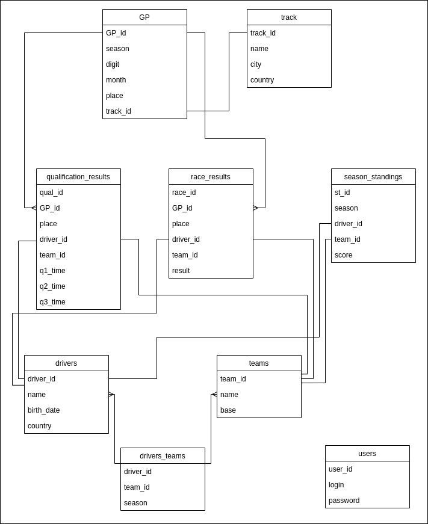
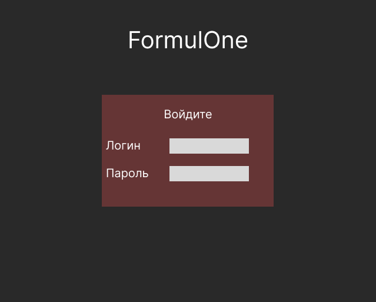
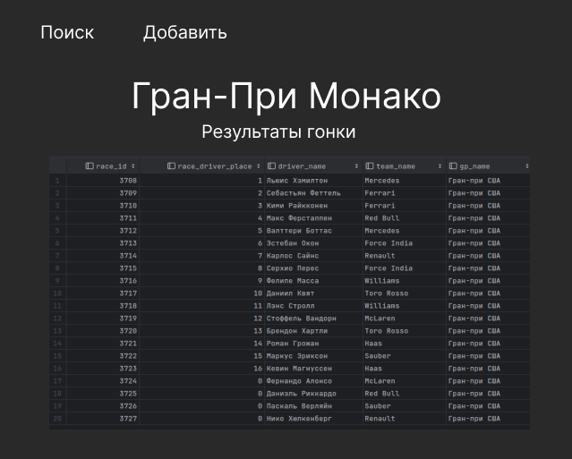
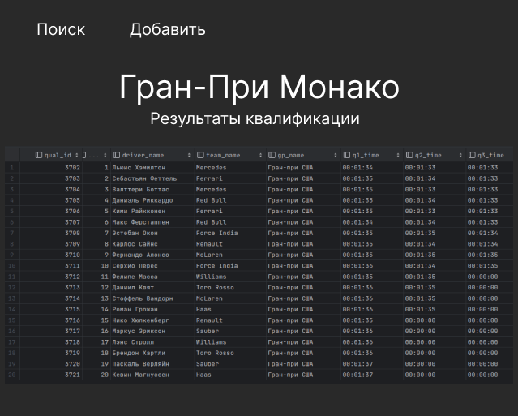
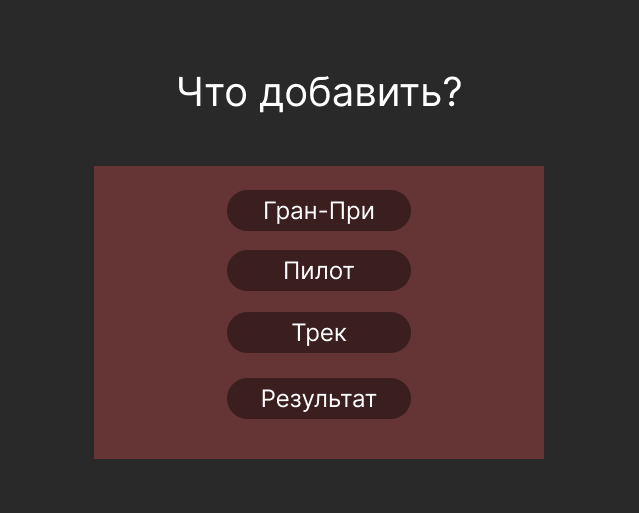
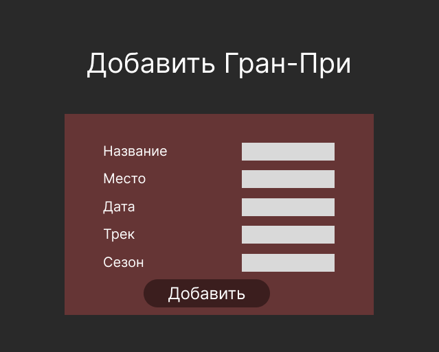
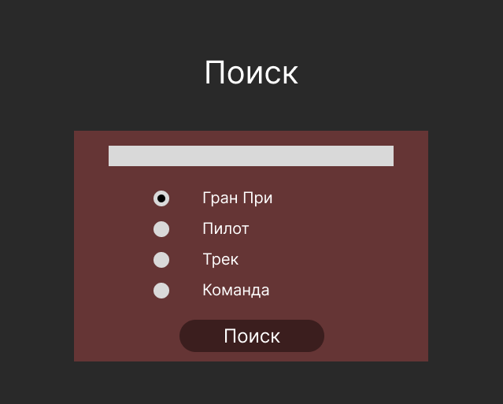

# FormulOne

## Цель

Разработка веб-приложения для отображения и обработки информации о прошедших Гран-При чемпионата «Формула-1»

### Проблема

Одним из самых популярных и зрелищных видов спорта является «Формула-1», которая с каждым годом стремительно увеличивает 
количество своих поклонников. В 2021 году число подписчиков Формулы 1 достигло 49.1 миллионов человек, при этом у нее 
самый высокий коэффициент вовлеченности по сравнению с другими крупными спортивными соревнованиями. Россия не является 
исключением в росте любителей этого автоспорта. 

Большое количество людей читает новости, смотрит трансляции и следит за результатами Гран-При. Одним из основных 
источников информации о результатах прошедших этапов чемпионата был официальный сайт. Однако весной 2022 года «Формула-1» 
разорвала контракт с компанией «Росгонки» и в целом прекратила сотрудничество с Россией, поэтому сайт Формулы 1 стал 
недоступен в нашей стране. В связи с этим поклонники чемпионата потеряли возможность просмотра официальных трансляций и 
результатов прошедших Гран-При.

Учитывая все вышесказанное, можно сделать вывод о том, что создание информационной системы, посвященной данной теме, 
упростит получение информации о гонках, пилотах, трассах и командах чемпионата Формулы 1.

## Функциональные требования

- регистрация пользователя
- авторизация
- CRUD операции с моделями
- поиск информации

## Use-case диаграмма

## BPMN-диаграмма основных бизнес процессов

## Примеры описания основных пользовательских сценариев

### Вход в систему

При входе в систему у пользователя будет запрашиваться логин и пароль. Если пользователь с таким ником существует и пароль
совпал, то пользователю будет разрешено войти в систему и он будет перенаправлен на главный экран.

### Поиск информации

У пользователя есть несколько вариантов по какой сущности произвести выбор. Для поиска необходимо ввести значение, по 
которому будет производиться поиск. По нажатию на кнопку поиска будут показаны результаты.

### Ввод новой информации

Админ может добавлять новые сущности. Для этого необходимо перейти на специальный экран, который доступен только админу, 
после чего выбрать сущность и ввести необходимые данные. После нажатия на кнопку сохранения данные будут сохранены в базе данных.

## ER-диаграмма сущностей

## Диаграмма БД

## Компонентная диаграмма системы

## Черновые эскизы

