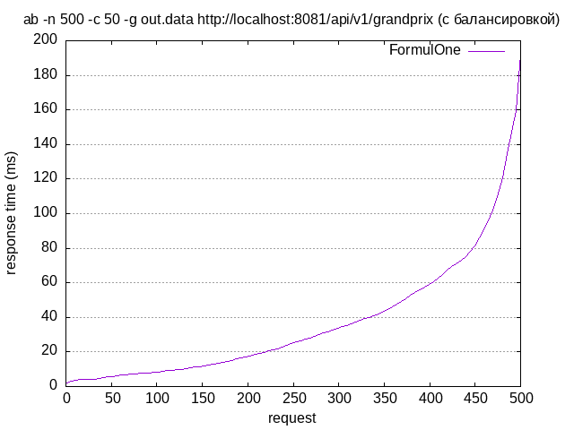
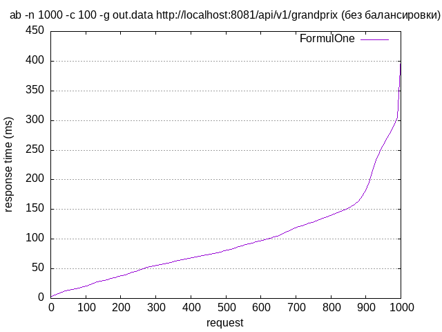
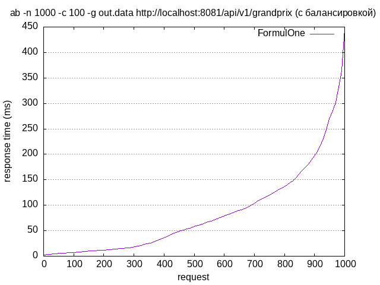
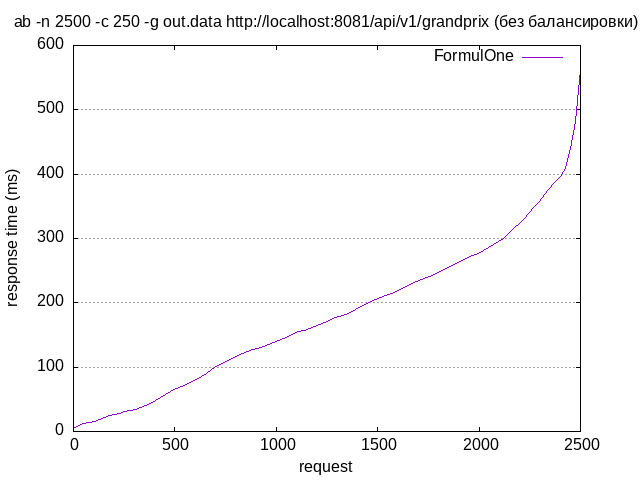
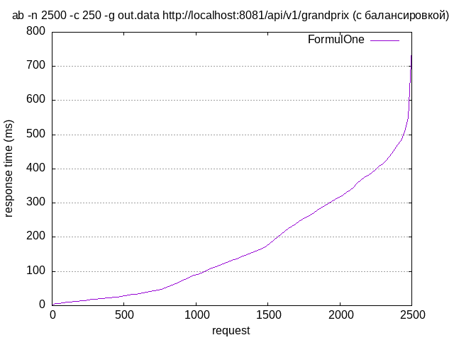

# Нагрузочное тестирование

Для проведения нагрузочного тестирования веб-веб сервера использовался Apache Benchmark.

Было проведено три теста с разным общим количеством запросов и с разным количеством параллельных запросов.

## Тест 1

#### Команда
```shell
ab -n 500 -c 50 -g out.data http://localhost:8081/api/v1/grandprix
```

### Результаты без балансировки

```
Server Software:        FormulOne
Server Hostname:        localhost
Server Port:            8081

Document Path:          /api/v1/grandprix
Document Length:        45456 bytes

Concurrency Level:      50
Time taken for tests:   0.488 seconds
Complete requests:      500
Failed requests:        0
Total transferred:      22791000 bytes
HTML transferred:       22728000 bytes
Requests per second:    1024.45 [#/sec] (mean)
Time per request:       48.806 [ms] (mean)
Time per request:       0.976 [ms] (mean, across all concurrent requests)
Transfer rate:          45602.20 [Kbytes/sec] received

Connection Times (ms)
              min  mean[+/-sd] median   max
Connect:        0    0   0.5      0       3
Processing:     3   46  27.6     45     124
Waiting:        3   43  27.4     43     124
Total:          4   46  27.7     45     124
```


### Результаты с балансировкой

```
Server Software:        FormulOne
Server Hostname:        localhost
Server Port:            8081

Document Path:          /api/v1/grandprix
Document Length:        45456 bytes

Concurrency Level:      50
Time taken for tests:   0.385 seconds
Complete requests:      500
Failed requests:        0
Total transferred:      22791000 bytes
HTML transferred:       22728000 bytes
Requests per second:    1299.87 [#/sec] (mean)
Time per request:       38.465 [ms] (mean)
Time per request:       0.769 [ms] (mean, across all concurrent requests)
Transfer rate:          57861.96 [Kbytes/sec] received

Connection Times (ms)
              min  mean[+/-sd] median   max
Connect:        0    0   0.5      0       3
Processing:     2   36  35.1     25     190
Waiting:        2   35  34.8     23     189
Total:          2   36  35.2     26     192
```




## Тест 2

#### Команда
```shell
ab -n 1000 -c 100 -g out.data http://localhost:8081/api/v1/grandprix
```

### Результаты без балансировки

```
Server Software:        FormulOne
Server Hostname:        localhost
Server Port:            8081

Document Path:          /api/v1/grandprix
Document Length:        45456 bytes

Concurrency Level:      100
Time taken for tests:   1.012 seconds
Complete requests:      1000
Failed requests:        0
Total transferred:      45582000 bytes
HTML transferred:       45456000 bytes
Requests per second:    988.13 [#/sec] (mean)
Time per request:       101.201 [ms] (mean)
Time per request:       1.012 [ms] (mean, across all concurrent requests)
Transfer rate:          43985.28 [Kbytes/sec] received

Connection Times (ms)
              min  mean[+/-sd] median   max
Connect:        0    0   0.7      0       4
Processing:     3   96  69.4     80     406
Waiting:        2   90  67.5     76     354
Total:          3   97  69.6     80     406
```



### Результаты с балансировкой

```
Server Software:        FormulOne
Server Hostname:        localhost
Server Port:            8081

Document Path:          /api/v1/grandprix
Document Length:        45456 bytes

Concurrency Level:      100
Time taken for tests:   0.859 seconds
Complete requests:      1000
Failed requests:        0
Total transferred:      45582000 bytes
HTML transferred:       45456000 bytes
Requests per second:    1164.52 [#/sec] (mean)
Time per request:       85.872 [ms] (mean)
Time per request:       0.859 [ms] (mean, across all concurrent requests)
Transfer rate:          51837.12 [Kbytes/sec] received

Connection Times (ms)
              min  mean[+/-sd] median   max
Connect:        0    0   0.6      0       3
Processing:     2   82  84.0     58     444
Waiting:        1   77  81.5     55     443
Total:          2   82  84.1     58     445
```




## Тест 3

#### Команда
```shell
ab -n 2500 -c 250 -g out.data http://localhost:8081/api/v1/grandprix
```

### Результаты без балансировки

```
Server Software:        FormulOne
Server Hostname:        localhost
Server Port:            8081

Document Path:          /api/v1/grandprix
Document Length:        45456 bytes

Concurrency Level:      250
Time taken for tests:   1.903 seconds
Complete requests:      2500
Failed requests:        467
   (Connect: 0, Receive: 0, Length: 467, Exceptions: 0)
Non-2xx responses:      467
Total transferred:      92781687 bytes
HTML transferred:       92428860 bytes
Requests per second:    1313.40 [#/sec] (mean)
Time per request:       190.346 [ms] (mean)
Time per request:       0.761 [ms] (mean, across all concurrent requests)
Transfer rate:          47601.25 [Kbytes/sec] received

Connection Times (ms)
              min  mean[+/-sd] median   max
Connect:        0    1   1.4      0       8
Processing:     3  180 115.3    171     560
Waiting:        3  172 113.5    166     553
Total:          4  181 115.5    172     563
```



### Результаты с балансировкой

```
Server Software:        FormulOne
Server Hostname:        localhost
Server Port:            8081

Document Path:          /api/v1/grandprix
Document Length:        45456 bytes

Concurrency Level:      250
Time taken for tests:   1.824 seconds
Complete requests:      2500
Failed requests:        313
   (Connect: 0, Receive: 0, Length: 313, Exceptions: 0)
Non-2xx responses:      313
Total transferred:      99763893 bytes
HTML transferred:       99423540 bytes
Requests per second:    1370.61 [#/sec] (mean)
Time per request:       182.401 [ms] (mean)
Time per request:       0.730 [ms] (mean, across all concurrent requests)
Transfer rate:          53412.91 [Kbytes/sec] received

Connection Times (ms)
              min  mean[+/-sd] median   max
Connect:        0    1   1.7      0      10
Processing:     3  173 149.6    131     752
Waiting:        2  165 145.3    126     618
Total:          3  173 149.7    132     752
```


